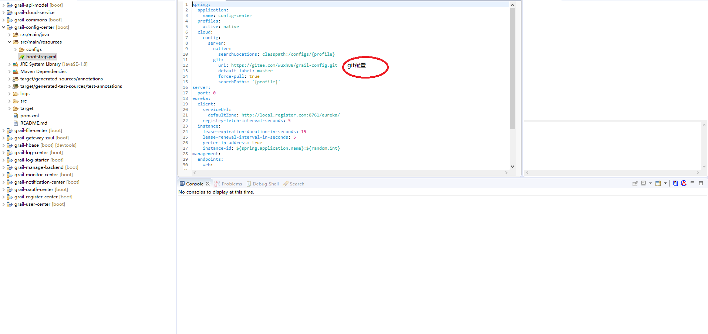

# grail-cloud
spring cloud快速开发框架，spring cloud版本Finchley.RELEASE

## 框架工程
1 	grail-register-center 	注册中心 	Spring Cloud Eureka实现

2 	grail-config-center 	配置中心 	Spring Cloud Config实现，配置文件支持本地或者git

3 	grail-user-center 	    用户中心 	用户、角色、权限、绑定手机号、微信网页公众号授权

4 	grail-oauth-center 	    认证中心 	Spring Cloud Oauth2实现，授权后提供access_token、支持用户名+密码、手机号+密码、手机号+短信验证码、微信公众号登陆

5 	grail-gateway-zuul 	    网关 	    Spring Cloud Zuul实现，路由分发请求到各个微服务

6 	grail-manage-backend 	管理后台 	菜单、ip黑名单维护，邮件发送、后台管理前端（前端支持分离部署）

7 	grail-log-center 	    日志中心 	各微服务aop拦截并发送日志，基于rabbitmq处理日志,存储到mysql或者elasticsearch

8 	grail-file-center 	    文件中心 	文件上传，实现了本地存储、阿里云，可自行扩展第三方存储

9 	grail-monitor-center 	监控中心 	Spring Boot Admin实现

10 	grail-notification-center 	通知中心 	阿里云短信、发送验证码   
11 grail-hbaser            hbase使用类

# 必要安装
redis、rabbitmq、elasticsearch、mysql、Lombok

# 非必要安装
hadoop hbase zipkin

# 配置host
好处：配置host后，就不用更改config中ip地址，就可以运行起来。所以最好使用hosts配置。

linux和windows的hosts配置可以百度

127.0.0.1 api.gateway.com

127.0.0.1 local.gateway.com 

127.0.0.1 local.register.com 

127.0.0.1 local.monitor.com 

127.0.0.1 local.mysql.com 

127.0.0.1 local.redis.com

127.0.0.1 local.rabbitmq.com 

# 模块说明
1	grail-config-center	配置中心

2	grail-file-center	文件中心

3	grail-gateway-zuul	网关

4	grail-log-center	日志中心

5	grail-manage-backend	管理后台

6	grail-monitor-center	监控中心

7	grail-oauth-center	认证中心

8	grail-register-center	注册中心

9	grail-user-center	用户中心

10	grail-notification-center	通知中心

11 grail-hbase hbase操作模块

# 启动顺序
1.	第一步启动注册中心

2.	第二步启动配置中心，目前配置中心拉取的是我的git的配置，可以更改。

3. 用户中心、通知中心、授权中心、文件服务、日志中心、后台管理、监控，最后启动zuul网关

4. 启动UI
http://localhost:8080/api-b/login.html
用户名admin 密码admin

## 运行如图
 
## 传送门
layui版前端: https://github.com/wuxh123/grail-layui

vue版前端:https://github.com/wuxh123/grail-vue

代码生成器:https://github.com/wuxh123/grail-generater
